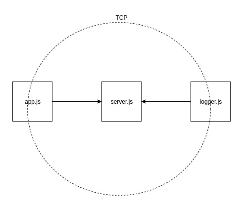

# 401-lab-14

## TCP Server / Message Application

### Author: Travis Skyles

### Links and Resources
* [submission PR](https://github.com/tskyles-401-advanced-javascript/401-lab-17/pull/1)
* [travis](https://travis-ci.com/tskyles-401-advanced-javascript/401-lab-17)

### Setup

#### How to initialize/run your server app (where applicable)
* `npm start`
* Endpoint: /docs
  * Returns JSdocs
  
#### Tests
* Unit Tests: `npm test`
* Lint Tests: `npm run lint`

#### UML
